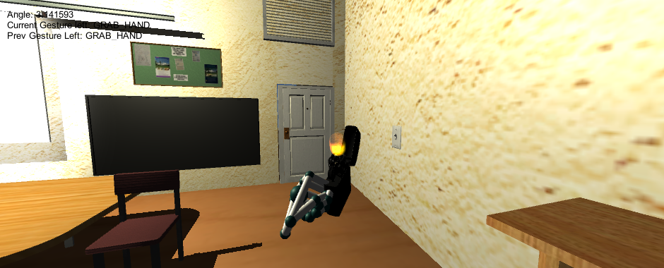

# Leap Motion Escape Room

About the game
==============
It is the project I developed for my degree thesis. It is a small "Escape Room" style videogame developed with Unity. The goal was to show a possible use of the Leap Motion device as the only input, so it is a videogame playable entirely with the Leap without using a mouse or keyboard. The aim is to escape from a room by interacting with the objects present in the scenario using Leap Motion.
